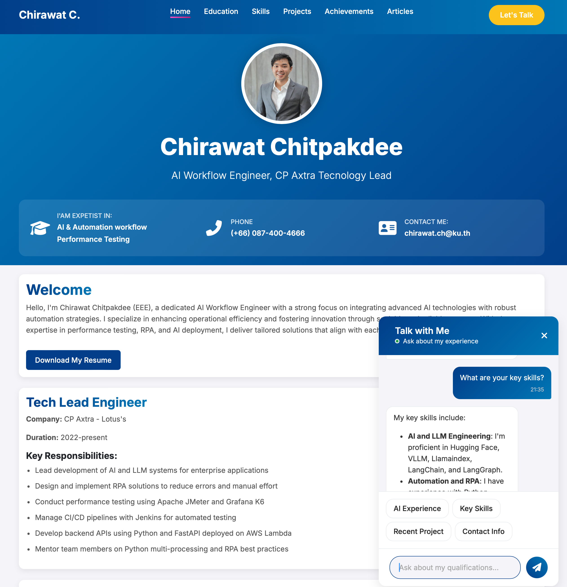

# AI-Powered Interactive Resume

Welcome to my interactive resume project! This repository contains the source code for a dynamic and cloud-native personal portfolio website. The purpose of this site is to serve as a live, interactive showcase of my professional experience, skills, and projects.

It's built with a modern tech stack, featuring a sleek, responsive frontend and a robust, serverless backend powered by AWS. This project not only displays my resume but also demonstrates my capabilities in full-stack development and cloud infrastructure management.

## Table of Contents

- [Key Features](#key-features)
- [Tech Stack](#tech-stack)
- [Project Overview](#project-overview)
- [Getting Started](#getting-started)
- [Deployment](#deployment)
  - [Frontend Deployment (AWS S3)](#frontend-deployment-aws-s3)
  - [Backend Deployment (AWS Lambda)](#backend-deployment-aws-lambda)
- [Usage](#usage)
- [Live Demo](#live-demo)
- [License](#license)

## Key Features

-   **Dynamic Content**: Fetches resume data from a serverless API, allowing for easy updates without changing the frontend code.
-   **Interactive UI**: A clean and modern user interface to navigate through different sections of the resume.
-   **Cloud-Native**: Fully deployed on AWS, showcasing experience with modern cloud services.
-   **Responsive Design**: Looks great on all devices, from desktops to mobile phones.
-   **Scalable Backend**: Built with AWS Lambda and API Gateway, the backend can handle varying loads efficiently.

## Tech Stack

### Frontend
-   **HTML5**
-   **CSS3**
-   **JavaScript (ES6+)**
-   **Marked.js**: For rendering Markdown content.

### Backend
-   **Node.js**: JavaScript runtime for the serverless functions.
-   **AWS Lambda**: For running serverless backend code.
-   **AWS API Gateway**: To create and manage the API.
-   **AWS S3**: For hosting the static frontend.

## Project Overview

This project is architected into two main components:

-   **Frontend**: A pure static website (`frontend/`) that acts as the presentation layer. It is responsible for rendering the user interface and fetching data from the backend API. It's designed to be simple, fast, and easily deployable on any static hosting service.
-   **Backend**: A serverless application (`backend/`) powered by Node.js and AWS Lambda. It exposes a single API endpoint that reads resume content from a text file and returns it in a structured format. This separation of concerns makes the application modular and scalable.

## Screenshot



## Live Demo

You can see a live version of this project at [chirawat.info](https://chirawat.info).

## Getting Started

To run this project locally for development and testing, follow these steps:

### Prerequisites

-   [Node.js](https://nodejs.org/) installed on your machine.
-   A code editor like [VS Code](https://code.visualstudio.com/).

### Frontend

1.  Open the `frontend/index.html` file directly in your web browser.
2.  For the best experience, especially to avoid CORS issues when fetching from a local backend, it's recommended to use a simple local server. If you have Python installed, you can run:
    ```bash
    # From the frontend/ directory
    python -m http.server
    ```
    Or use the [Live Server](https://marketplace.visualstudio.com/items?itemName=ritwickdey.LiveServer) extension in VS Code.

### Backend

1.  Navigate to the `backend/` directory:
    ```bash
    cd backend
    ```
2.  Install the dependencies:
    ```bash
    npm install
    ```
3.  To simulate the Lambda environment locally, you can create a simple script to run the handler function. Or, you can deploy it to AWS and use the live endpoint for development.

## Deployment

This guide provides instructions on how to deploy the frontend and backend to AWS.

### Frontend Deployment (AWS S3)

The frontend is a static website that can be hosted on AWS S3.

1.  **Create an S3 Bucket:**
    -   Navigate to the S3 service in the AWS Management Console.
    -   Click "Create bucket".
    -   Enter a unique bucket name (e.g., `my-resume-website`).
    -   Choose an AWS Region.
    -   Uncheck "Block all public access" and acknowledge the warning.
    -   Click "Create bucket".

2.  **Upload Frontend Files:**
    -   Navigate to the created bucket.
    -   Click "Upload".
    -   Upload all the files and folders from the `frontend/` directory of this project.

3.  **Enable Static Website Hosting:**
    -   In your S3 bucket, go to the "Properties" tab.
    -   Scroll down to "Static website hosting" and click "Edit".
    -   Select "Enable".
    -   Set the "Index document" to `index.html`.
    -   Click "Save changes".

4.  **Set Bucket Policy for Public Access:**
    -   Go to the "Permissions" tab of your S3 bucket.
    -   Under "Bucket policy", click "Edit".
    -   Paste the following JSON policy, replacing `YOUR_BUCKET_NAME` with your actual bucket name:

    ```json
    {
        "Version": "2012-10-17",
        "Statement": [
            {
                "Sid": "PublicReadGetObject",
                "Effect": "Allow",
                "Principal": "*",
                "Action": "s3:GetObject",
                "Resource": "arn:aws:s3:::YOUR_BUCKET_NAME/*"
            }
        ]
    }
    ```
    -   Click "Save changes".

5.  **Access Your Website:**
    -   Go back to the "Properties" tab and find the "Static website hosting" section.
    -   Your website URL will be displayed there.

### Backend Deployment (AWS Lambda)

The backend is a Node.js application designed to run as an AWS Lambda function.

1.  **Prepare the Deployment Package:**
    -   Navigate to the `backend/` directory in your terminal.
    -   Install dependencies: `npm install`
    -   Create a `.zip` file containing `index.mjs`, `node_modules/`, and any other required files (like `resumeContent.txt`).

    ```bash
    # In the backend directory
    zip -r backend.zip .
    ```

2.  **Create a Lambda Function:**
    -   Navigate to the Lambda service in the AWS Management Console.
    -   Click "Create function".
    -   Select "Author from scratch".
    -   Enter a function name (e.g., `myResumeAPI`).
    -   For "Runtime", select the appropriate Node.js version (e.g., Node.js 18.x or later).
    -   For "Architecture", select `x86_64`.
    -   Click "Create function".

3.  **Upload the Code:**
    -   In the "Code source" section, click "Upload from".
    -   Select ".zip file".
    -   Upload the `backend.zip` file you created earlier.
    -   Click "Save".

4.  **Configure the Handler:**
    -   Go to the "Configuration" tab and then "General configuration".
    -   Click "Edit".
    -   The handler for an ES module (`.mjs`) should be `index.handler` (assuming your exported function is named `handler` in `index.mjs`).

5.  **Create an API Gateway Trigger:**
    -   Go back to the function's overview.
    -   Click "Add trigger".
    -   Select "API Gateway".
    -   Choose "Create a new API".
    -   Select "HTTP API" for simplicity and lower cost.
    -   For "Security", you can select "Open" for a public API.
    -   Click "Add".

6.  **Get Your API Endpoint:**
    -   After the trigger is created, the API endpoint URL will be displayed in the API Gateway section on the Lambda function's page. You will use this URL in your frontend code to make API calls.

## Usage

After deploying both the frontend and backend, you need to update the frontend code to use the new API Gateway endpoint URL.

1.  Open `frontend/script.js`.
2.  Find the variable that holds the API endpoint URL.
3.  Replace the placeholder URL with the actual API Gateway endpoint URL you obtained in the backend deployment steps.
4.  Re-upload the modified `script.js` to your S3 bucket.

## License

This project is open-source and available under the [MIT License](LICENSE).
